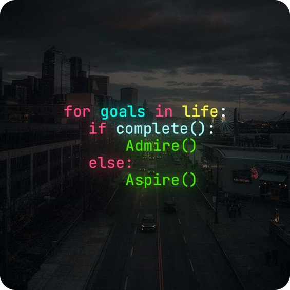

<h1 align="left">👋 Hola, soy Gabriel.</h1>

###

###

<blockquote align="left" style="padding-start: 15px">Soy desarrollador fullstack con experiencia en Java, Angular y bases de datos relacionales. Actualmente estoy finalizando mis estudios y trabajando en proyectos personales para seguir mejorando mis habilidades. Me interesa trabajar en equipos donde pueda seguir aprendiendo, aportar valor y crecer profesionalmente.</blockquote>

###

  
  

###

<h2 align="left">Mis herramientas</h2>

###

  
  
  
  
  
  
  
  
  
  
  
  
  
  
  
  
  
  
  
  
  
  
  
  
  
  
  
  
  
  
  
  
  
  
  
  
  
  
  
  
  

###

  

###

 

<!--  -->

###

🤝 Si querés charlar, colaborar o tenés alguna oportunidad interesante, no dudes en contactarme.

###

  

###
